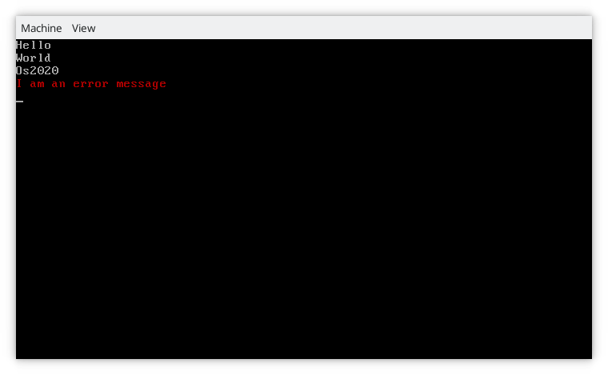

# Os 2020

Os 2020 is a 32 bits OS.

Written in C and assembly (NASM), it provides a custom bootloader and a libc.

## Some screenshots

## Features

This OS aims to improve an older OS I made named '[OctOs](https://github.com/Cc618/OctOs)'.

Os 2020 contains a second stage bootloader.

Here is the list of improvements :

- Boot system : There are 2 bootloaders, the OS is dynamically loaded. It will detects the end of the chunks at run time.
- libc : OctOs was written in C++ and had a custom standard library. Os 2020 will have a libc (not fully implemented, see [this file](doc/libc.md) for details).
- syscalls : To implement the libc, we will use syscalls to interact with the kernel.
- Linker, architecture... : The goal is to write everything from scratch to have a clean code. OctOs was inspired by many websites / repos, Os 2020 will have a refactored code.
- File IO : This OS will implements file IO functions.
- _No mistakes_ : OctOs suffered from memory leaks because of C++ constructors / destructors. Os 2020 will implements constructors sections if necessary and uses C.

## Architecture

- doc : Documentation
- src/boot : Boot / Loader chunks implementation (full Asm).
- src/kernel : Core chunk.
- src/libc : The libc implementation.

## Depedencies

- gcc cross compiler (for i386)
- nasm
- qemu-system-i386 (optional, to test)
- objcopy (optional, to debug)
- gdb (optional, to debug)
