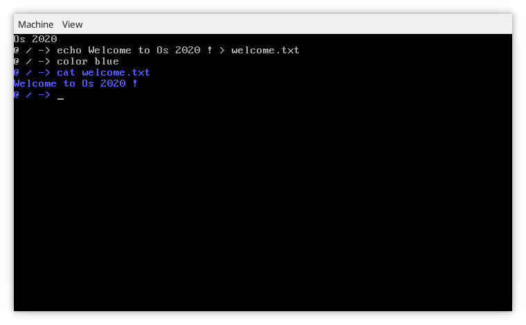
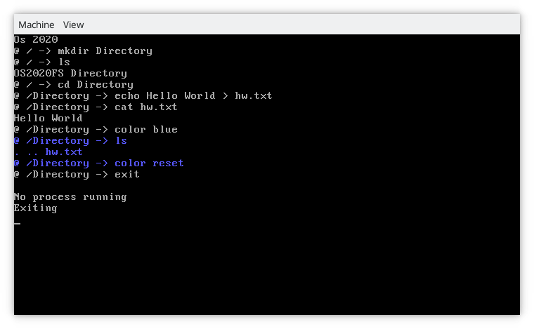

# Os 2020

Os 2020 is a 32 bits OS.

Written in C and assembly (NASM), it provides a custom bootloader and a libc.

## Some screenshots

## Features

This OS aims to improve an older OS I made named '[OctOs](https://github.com/Cc618/OctOs)'.

Here is the list of improvements :

- Boot system : A second stage bootloader is implemented so there are 2 bootloaders, the OS is dynamically loaded. It will detects the end of the chunks at run time
- Libraries : OctOs was written in C++ and had a custom standard library. Os 2020 will have a libc (not fully implemented, see [this file](doc/lib.md) for details) and also a libk, the libc gathers main IO / string functions and libk handles system related functions such as syscalls and utils such as data structures or path functions
- syscalls : The main goal is not to make a user mode but to provide syscalls for apps
- File IO : This OS provides a Fat32 driver with scripts to retrieve or replace the file system of the Os (see [this file](doc/fs.md) for details)
- Apps : Os 2020 contains several processes (called apps) inspired from linux like ls, cat, echo and also a shell with input redirection, go [here](doc/shell.md) to see shell functions
- Memory : OctOs suffered from memory leaks because of C++ constructors / destructors. Os 2020 won't use constructors and uses C.

## Architecture

- doc : Documentation
- src/stage1 : First bootloader chunk (full Asm)
- src/stage2 : Second bootloader chunk
- src/kernel : Core chunk
- src/lib : Libc and libk

## Depedencies

- gcc cross compiler (for i386)
- nasm
- mtools (add /sbin to your path, for fs)
- qemu-system-i386 (optional, to test)
- objcopy (optional, to debug)
- gdb (optional, to debug)
- xterm (optional, to debug)
